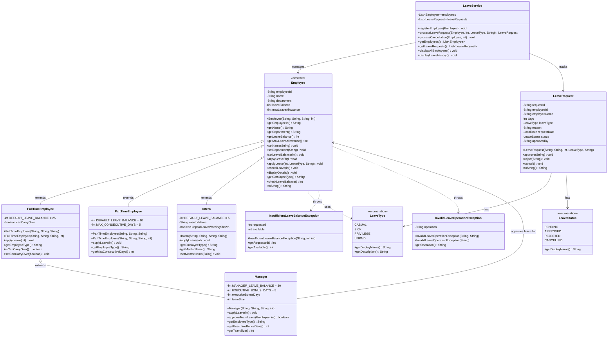

# Class Diagram - Leave Management System
## Student: GOLLA RAVITEJA

```mermaid
classDiagram
    class Employee {
        <<abstract>>
        -String employeeId
        -String name
        -String department
        #int leaveBalance
        #int maxLeaveAllowance
        +Employee(String, String, String, int)
        +getEmployeeId() String
        +getName() String
        +getDepartment() String
        +getLeaveBalance() int
        +getMaxLeaveAllowance() int
        +setName(String) void
        +setDepartment(String) void
        #setLeaveBalance(int) void
        +applyLeave(int) void*
        +applyLeave(int, LeaveType, String) void
        +cancelLeave(int) void
        +displayDetails() void
        +getEmployeeType() String*
        +checkLeaveBalance() int
        +toString() String
    }

    class FullTimeEmployee {
        -int DEFAULT_LEAVE_BALANCE = 25
        -boolean canCarryOver
        +FullTimeEmployee(String, String, String)
        +FullTimeEmployee(String, String, String, int)
        +applyLeave(int) void
        +getEmployeeType() String
        +isCanCarryOver() boolean
        +setCanCarryOver(boolean) void
    }

    class PartTimeEmployee {
        -int DEFAULT_LEAVE_BALANCE = 10
        -int MAX_CONSECUTIVE_DAYS = 5
        +PartTimeEmployee(String, String, String)
        +PartTimeEmployee(String, String, String, int)
        +applyLeave(int) void
        +getEmployeeType() String
        +getMaxConsecutiveDays() int
    }

    class Intern {
        -int DEFAULT_LEAVE_BALANCE = 5
        -String mentorName
        -boolean unpaidLeaveWarningShown
        +Intern(String, String, String, String)
        +applyLeave(int) void
        +getEmployeeType() String
        +getMentorName() String
        +setMentorName(String) void
    }

    class Manager {
        -int MANAGER_LEAVE_BALANCE = 30
        -int EXECUTIVE_BONUS_DAYS = 5
        -int executiveBonusDays
        -int teamSize
        +Manager(String, String, String, int)
        +applyLeave(int) void
        +approveTeamLeave(Employee, int) boolean
        +getEmployeeType() String
        +getExecutiveBonusDays() int
        +getTeamSize() int
    }

    class LeaveRequest {
        -String requestId
        -String employeeId
        -String employeeName
        -int days
        -LeaveType leaveType
        -String reason
        -LocalDate requestDate
        -LeaveStatus status
        -String approvedBy
        +LeaveRequest(String, String, int, LeaveType, String)
        +approve(String) void
        +reject(String) void
        +cancel() void
        +toString() String
    }

    class LeaveType {
        <<enumeration>>
        CASUAL
        SICK
        PRIVILEGE
        UNPAID
        +getDisplayName() String
        +getDescription() String
    }

    class LeaveStatus {
        <<enumeration>>
        PENDING
        APPROVED
        REJECTED
        CANCELLED
        +getDisplayName() String
    }

    class InsufficientLeaveBalanceException {
        -int requested
        -int available
        +InsufficientLeaveBalanceException(String, int, int)
        +getRequested() int
        +getAvailable() int
    }

    class InvalidLeaveOperationException {
        -String operation
        +InvalidLeaveOperationException(String, String)
        +InvalidLeaveOperationException(String)
        +getOperation() String
    }

    class LeaveService {
        -List~Employee~ employees
        -List~LeaveRequest~ leaveRequests
        +registerEmployee(Employee) void
        +processLeaveRequest(Employee, int, LeaveType, String) LeaveRequest
        +processCancellation(Employee, int) void
        +getEmployees() List~Employee~
        +getLeaveRequests() List~LeaveRequest~
        +displayAllEmployees() void
        +displayLeaveHistory() void
    }

    Employee <|-- FullTimeEmployee : extends
    Employee <|-- PartTimeEmployee : extends
    Employee <|-- Intern : extends
    FullTimeEmployee <|-- Manager : extends
    Employee ..> LeaveType : uses
    Employee ..> InsufficientLeaveBalanceException : throws
    Employee ..> InvalidLeaveOperationException : throws
    LeaveRequest --> LeaveType : has
    LeaveRequest --> LeaveStatus : has
    LeaveService --> Employee : manages
    LeaveService --> LeaveRequest : tracks
    Manager --> Employee : approves leave for
```
